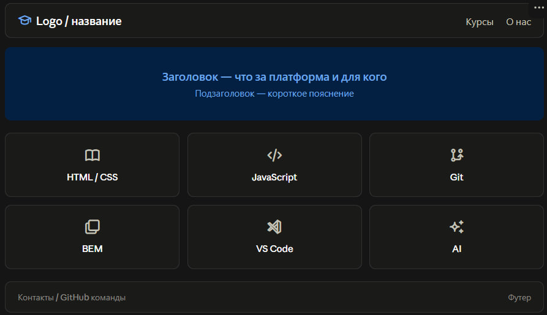
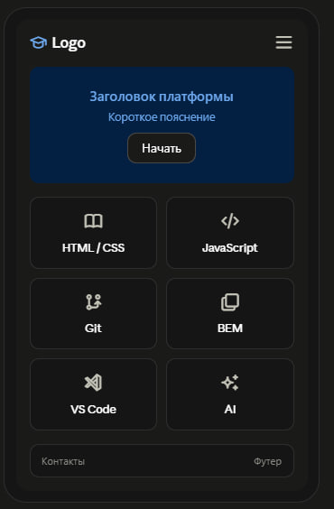

## Axiom

Образовательная платформа для студентов курса веб-разработки: материалы, ссылки и полезные ресурсы по темам курса.

## Демо

[Ссылка на GitHub Pages будет здесь после деплоя]

## Как запустить локально

1. Склонируйте репозиторий:
   ```
   git clone https://github.com/Djambolat/Axiom.git
   ```
2. Откройте `index.html` в браузере, либо запустите через расширение Live Server в VS Code (правый клик по файлу → "Open with Live Server").

## Макет




## Структура проекта

```
axiom/
├── index.html
├── pages/
│   ├── courses.html    (бывший materials.html)
│   ├── about.html
│   ├── html-css.html
│   ├── js.html          (бывший javascript.html)
│   ├── git.html
│   ├── bem.html
│   ├── vscode.html
│   └── ai.html
├── style/
│   ├── style.css
│   ├── variables.css
│   ├── reset.css
│   └── components/
│       ├──
│       ├──
│       └──
├── script/
│   └── script.js
├── images/
├── icons/
└── README.md
```

## Работа с ветками

Формат названия: `название_изменения--branch`

пример:

- `add_header_style--branch` — добавил стили в шапку
- `add_background--branch` — добавил задний фон

Не работаем напрямую в `main`. Каждое изменение — через отдельную ветку и Pull Request.

## Правила коммитов

Пишем, что именно сделано, в повелительном наклонении:

```
add product card
fix links
update readme file
```

Коммитим часто, небольшими порциями.

## Процесс ревью

1. Открыли PR из своей ветки в `main`.
2. Назначили ревьюером любого другого участника команды (не мерджим свои PR без одобрения).
3. Ревьюер оставляет комментарии в разделе "Files changed".
4. Автор вносит правки в той же ветке.
5. После "Approve" — мерджим и удаляем ветку.

## Стек

HTML, CSS (БЭМ), JavaScript
